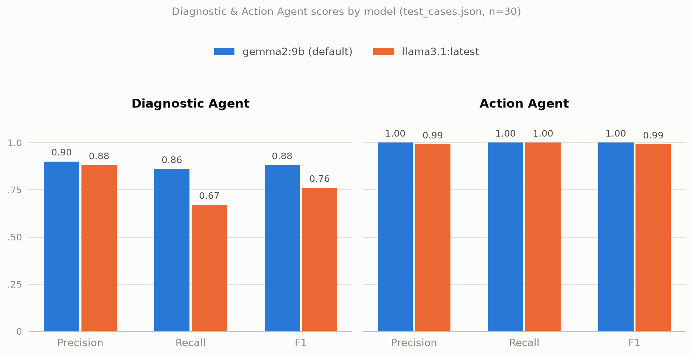

# PracticeOps Agents

A two-agent LLM system that analyzes medical practice operational metrics, identifies
workflow problems, and recommends predefined operational actions — running entirely on a
local [Ollama](https://ollama.com) model (`gemma2:9b`), no API key or GPU required.

## Problem statement

Medical practices collect operational metrics (no-show rate, portal adoption, check-in
time, phone-call volume, claim denial rate, provider utilization) but a traditional
dashboard just displays the numbers and leaves interpretation to the practice manager.
PracticeOps Agents uses two constrained LLM agents to turn those raw metrics into
structured, actionable recommendations. It does not diagnose patients, process protected
health information, or make clinical decisions.

## Architecture

```
Practice Metrics
      |
      v
LLM Agent 1
Diagnostic Agent
      |
      v
Structured Issue Labels
      |
      v
LLM Agent 2
Action Agent
      |
      v
Structured Action Labels
      |
      v
Streamlit Dashboard
```

The agents communicate through structured JSON. There is no memory system, retrieval
pipeline, vector database, or autonomous planning loop.

## Agents

### Agent 1 — Diagnostic Agent
Reads specialty, provider count, appointment volume, and the six operational metrics.
Selects zero or more issues from a fixed label set by applying the same documented
threshold rules used to build the evaluation ground truth:

| Rule | Issue |
|---|---|
| `no_show_rate >= 0.15` | `high_no_show` |
| `portal_adoption_rate < 0.40` | `low_portal_use` |
| `average_check_in_minutes >= 15` | `long_check_in` |
| `weekly_phone_calls >= 600` | `front_desk_overload` |
| `claim_denial_rate >= 0.08` | `billing_risk` |
| `provider_utilization < 0.70` | `low_provider_utilization` |

Output: `{"issues": ["high_no_show", ...]}`

### Agent 2 — Action Agent
Receives Agent 1's issue labels and selects the matching actions from a fixed catalog
using a 1:1 controlled mapping:

| Issue | Action |
|---|---|
| `high_no_show` | `send_appointment_reminders` |
| `low_portal_use` | `promote_portal_enrollment` |
| `long_check_in` | `enable_digital_intake` |
| `front_desk_overload` | `review_front_desk_workflow` |
| `billing_risk` | `review_claim_denials` |
| `low_provider_utilization` | `rebalance_provider_schedule` |

Output: `{"actions": ["send_appointment_reminders", ...]}`

Both agents are given their allowed label list and rules directly in the prompt, are
called with `temperature: 0` and Ollama's `format: "json"` mode, and any label outside
the allowed catalog is stripped and counted toward the unsupported-label rate rather than
passed through.

## Build order

The project was built in dependency order — data and pinned deps first, then the shared
agent module everything else imports, then the two things that consume it, then the
reporting layer on top:

```
requirements.txt -> test_cases.json -> agents.py -> evaluate.py -> app.py
                                                          |
                                                          v
                                          report_template.html -> generate_report.py -> report.html
```

`agents.py` was revisited after `evaluate.py`/`app.py` already existed, once model
comparison (see Evaluation below) settled on switching the default from `llama3.1:latest`
to `gemma2:9b`.

## Setup

```bash
# 1. Create/activate the virtual environment
python3 -m venv venv_praticeops_agent
source venv_praticeops_agent/bin/activate

# 2. Install dependencies
pip install -r requirements.txt

# 3. Pull and serve the local model (only needs to be done once; ollama serve
#    may already be running as a background service)
ollama pull gemma2:9b
ollama serve

# 4. Configure environment (defaults already match a standard local Ollama install)
cp .env.example .env

# 5. Run the evaluation suite
python evaluate.py

# 6. Run the interactive dashboard
streamlit run app.py
```

## Synthetic dataset

`test_cases.json` is a hand-built, synthetic set of 30 fictional practices (`P001`–`P030`)
across 28 medical specialties (Dermatology, Family Medicine, Cardiology, Orthopedics,
Psychiatry, Pediatrics, and others) — no real practice or patient data is used anywhere in
this project. Each case pairs a plausible metrics profile with hand-labeled ground truth:

- `metrics` — the same nine fields the dashboard collects (specialty, providers,
  monthly appointments, and the six operational rates/counts), spanning realistic ranges
  (e.g. 4–20 providers, 800–6,500 monthly appointments, 5%–25% no-show rate, 20%–95% portal
  adoption) chosen to sit on both sides of every threshold in the rules table above.
- `expected_issues` — the issue labels a correct application of the threshold rules
  produces for that practice, including 9 "healthy practice" cases with an empty list.
- `expected_actions` — the corresponding ground-truth actions, derived from
  `expected_issues` via the fixed 1:1 mapping.

Because both ground-truth fields are generated deterministically from the same threshold
and mapping rules given to the agents (rather than sourced from real EHR/PM system
exports), the dataset is best read as a controlled unit-test suite for rule-following and
JSON-formatting behavior, not a benchmark of real-world diagnostic difficulty.

## Evaluation

`evaluate.py` scores both agents against `test_cases.json` (30 hand-built cases spanning
all six issue labels and nine "healthy practice" cases with zero expected issues) using
multi-label precision, recall, and F1. Agent 2 is scored against ground-truth issue labels
(not Agent 1's predictions) so its score isn't polluted by Agent 1's classification errors
— the live dashboard, by contrast, chains Agent 1's real output into Agent 2.

`gemma2:9b` is the model used by default (see `OLLAMA_MODEL` in `.env`), chosen after
comparing it against other locally-available models on the same test suite:

| Model | Agent | Precision | Recall | F1 |
|---|---|---|---|---|
| `gemma2:9b` (default) | Diagnostic Agent | 0.90 | 0.86 | 0.88 |
| `gemma2:9b` (default) | Action Agent | 1.00 | 1.00 | 1.00 |
| `llama3.1:latest` | Diagnostic Agent | 0.88 | 0.67 | 0.76 |
| `llama3.1:latest` | Action Agent | 0.99 | 1.00 | 0.99 |



The gap between models is almost entirely a recall gap on the Diagnostic Agent (0.86 vs.
0.67) — `gemma2:9b` catches more of the true issue labels per practice, while both models
hold similarly high precision. The Action Agent is near-parity either way, since mapping a
given set of issues to actions is a simpler, more mechanical task than reading thresholds
off raw metrics. Regenerate this chart with `python generate_charts.py` (needs
`pip install matplotlib`) after any change to the numbers above.

Supporting reliability metrics:

| Model | JSON validity rate | Unsupported-label rate |
|---|---|---|
| `gemma2:9b` (default) | 100% | 1% (target 0%) |
| `llama3.1:latest` | 100% | 0% |

`gemma2:9b` clearly leads `llama3.1:latest` on the Diagnostic Agent's threshold-reasoning
task (F1 0.88 vs. 0.76, mainly a recall gap — 0.86 vs. 0.67), at the cost of somewhat higher
latency (5.4GB vs. 4.7GB model) and an occasional out-of-catalog label that gets filtered
before display. `mistral:latest` was also tried and trailed both at F1 0.49 on the
Diagnostic Agent. Swap the `OLLAMA_MODEL` value in `.env` to compare further — both tables
above were produced by re-running `evaluate.py` with `OLLAMA_MODEL` set to each model.

## Limitations

- Does not diagnose patients, process PHI, or make clinical decisions — operational
  workflow signals only.
- Single practice, single page, no authentication, no database, no persistence.
- Label catalogs are fixed by design; the agents cannot invent new issues or actions.
- Diagnostic accuracy depends on the local model — results will vary between Ollama models.

## Next steps for deployment

This project currently runs as a local, single-user Streamlit prototype. Moving it toward
a real deployment would mean addressing, roughly in order:

1. **Real data validation** — replace the synthetic `test_cases.json` with metrics sampled
   or derived from actual practice-management/EHR exports, and re-run the evaluation to see
   whether accuracy holds outside the hand-built threshold cases.
2. **Auth & multi-practice support** — add login and per-practice data isolation; today the
   app has no authentication and holds one practice's metrics in memory per session.
3. **Persistence & history** — store metrics snapshots and agent output in a database so
   trends (e.g. no-show rate over time) can be tracked instead of re-entered each session.
4. **Model hosting decision** — decide between continuing to run Ollama on a managed VM/
   container (keeps data fully local, no per-call cost) versus swapping in a hosted API
   model for higher throughput/concurrency; `agents.py` isolates this behind `OLLAMA_HOST`/
   `OLLAMA_MODEL`, so either path reuses the same prompt and label-filtering logic.
5. **Automated ingestion** — replace the manual form in `app.py` with a scheduled pull from
   the practice's actual metrics source (PM system API, nightly export, etc.).
6. **Monitoring in production** — track the JSON-validity and unsupported-label rates
   (already computed in `evaluate.py`) as live metrics post-deployment, with alerting if
   either regresses, since both are leading indicators of model drift or prompt breakage.
7. **Human-in-the-loop review** — given this still touches practice operations, add a
   confirm/override step before any recommended action is treated as taken, rather than
   presenting agent output as a final decision.
